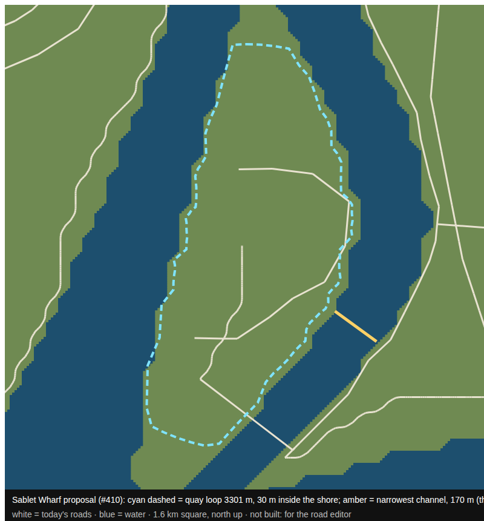

# Sablet Wharf: a proposal for the road editor (#410)

The owner decided on 2026-09-29: a **working container port**, a **second way
out by a jump** across a channel, and a **quay that runs the full waterline**
as a loop through the container rows, which is also the wharf's race route.

This is the measured groundwork for that, not the build. Roads in Kestrel Bay
are authored in the road editor and synced (`npm run roadsync`), so the loop
here is a starting line to load and correct by hand, not something written into
`city/roads.ts`.

- **Quay loop** (cyan dashed, `quay-loop.json`, world metres as `[x, z]`): 90
  points traced by ray from the place's centre (-1634, -1955) every 4°, 30 m
  inside the first water. **3.3 km**, steepest step **10%**, inside what
  `npm run grades` allows. 80 of the 90 points follow a shore; the other 10
  are the south end, capped at 700 m where the land runs out to sea.
- **The jump out** (amber): the narrowest crossing from the peninsula to other
  land is **170 m**, at 126° from the centre, from (-1343, -2167) to
  (-1205, -2267), landing beside the road on the south-east bank. At the
  game's gravity (22 m/s²) a 15-20° lip throws a car at the reference top
  speed (about 89 m/s) roughly 180-250 m, so it clears only near flat out:
  a way out for a driver who knows it, and one the police cannot follow.
- **Today's roads** (white): the one bridge in from the south, the spine to
  the centre, and the stubs that #410's audit lists.

Measured on `CITY_SEED` against the frozen landmass. Redrawn by a throwaway
script over `inWater` and `groundAt`; rerun it the same way if the land moves.
